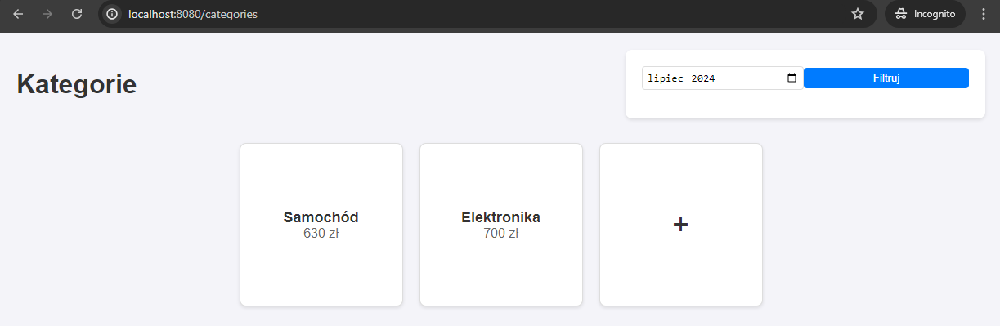
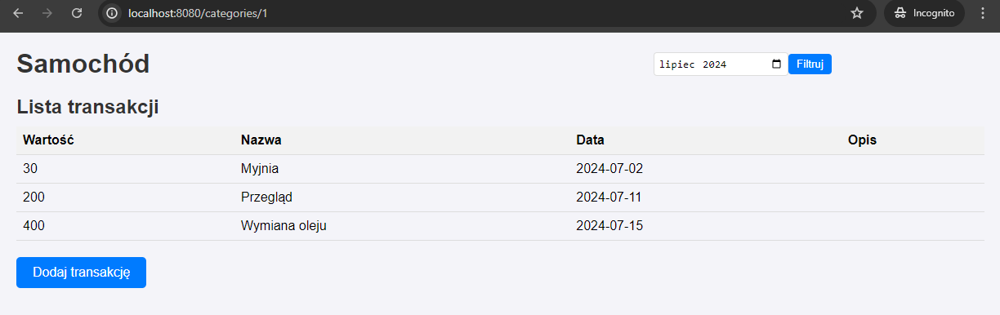
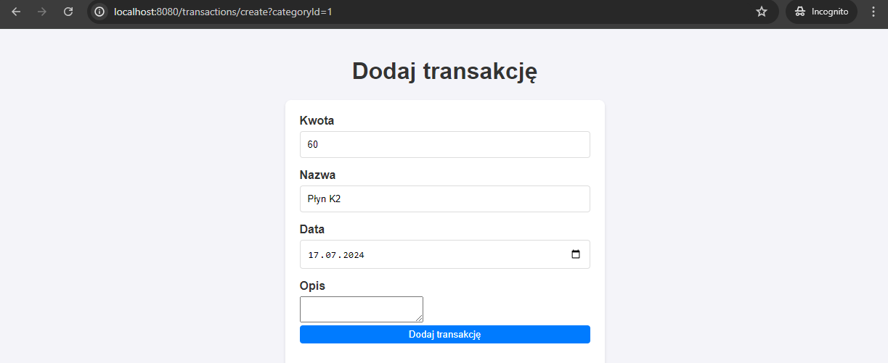
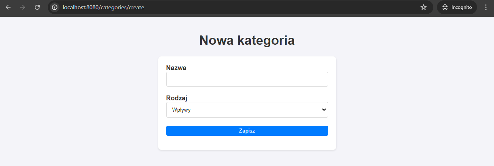
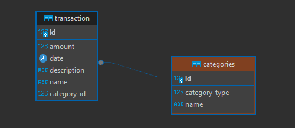

## How to run
- run datebase: 
``docker run -d --name postgresql--kontener-budgetapp -e POSTGRES_DB=database -e POSTGRES_USER=postgres -e POSTGRES_PASSWORD=postgres -p 5432:5432 postgres``
- run spring boot  ``mvn spring-boot:run``

[//]: # (http://localhost:8080/swagger-ui/index.html)

## Screenshots

## Functionalities of Budget App
- creating category
- adding transactions
- viewing transactions for each category
- viewing category and transactions for selected month
- viewing sum of incomes/expenses for each category

## TODO
The next things I will do in the project
- Change the Thymeleaf template to something newer
- Add user login
- Write unit tests

## Tools which I used
- java
- spring data jpa
- hibernate
- postgresql
- lombok

## Database

